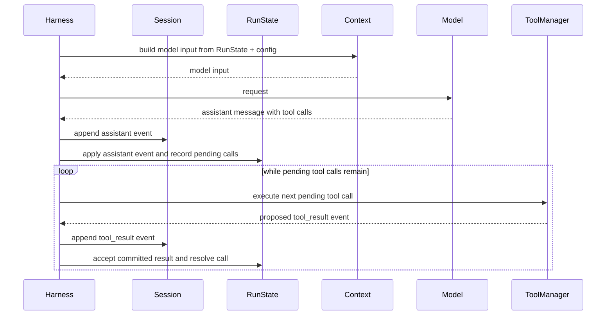
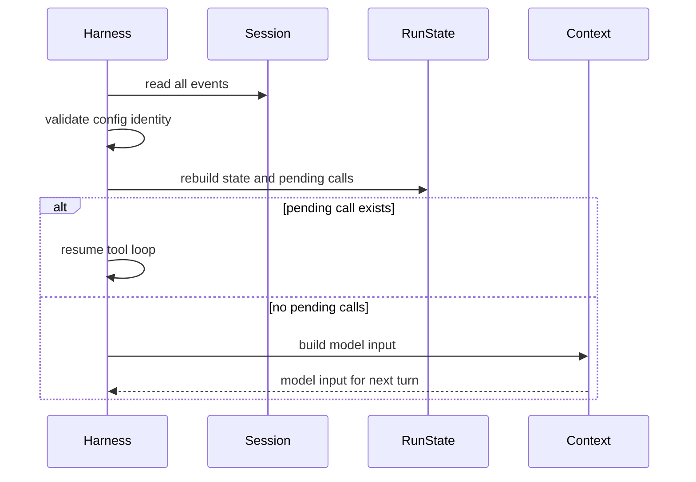

# Agent Harness Architecture

## Goal

Build a minimal resumable harness for running agent tasks and comparing harness configurations. A harness is the program that runs the model, tools, task environment, and recovery logic.

## Problem

Agent runs need a durable record of what happened and a temporary model context built from that record. If model context is the source of truth, trimming, compaction, or output offloading can permanently lose information.

Durable state is state that must survive a pause, crash, or resume. Temporary runtime state is things like clients, caches, process handles, or a live sandbox process.

## Rules

1. The session log is the authoritative recovery record. After a crash or pause, the harness resumes from the session log, artifacts referenced by that log, and the same config.
2. Live state is rebuildable. `RunState`, module state, sandbox handles, caches, and model context are runtime views derived from the recovery record.
3. The harness is the only component that commits to the session. Tools and modules can propose results, but the harness decides what becomes durable.
4. Every completed tool call is recorded as one `tool_result` event. That event contains both the output shown to the model and the state changes needed for recovery.
5. The model only sees committed tool results. If a tool result cannot be committed, the harness discards live state and rebuilds from the recovery record before continuing.
6. A committed assistant message may create pending tool calls. A call stays pending until the session contains a committed `tool_result` for the same `call_id`.

After a pause or crash, the harness must be able to continue from:

```text
session events + referenced snapshots + same config
```

If rebuilding from the recovery record fails, the run cannot safely continue. The harness records a terminal error if the session is writable, then stops.

## Runtime Flow



During tool execution, modules may update live state. That state is only trusted after the matching `tool_result` event is committed. If the commit fails, the harness throws away live state and rebuilds from the session. Recovery lands at the start of the run loop: if the assistant message was committed but the tool result was not, the same tool call is pending again and is retried before another model request. If rebuild fails, the run ends with an error.

## Recovery Flow



After each committed event, normal execution and resume must produce the same recoverable state. Replay uses `apply(event)` and never re-executes tools by itself.

After replay, the harness checks `RunState` for pending tool calls. If any exist, it resumes tool execution from the oldest pending call instead of building a new model request.

## Harness Loop

The run loop always handles pending tool calls before asking the model for another message. Recovery and rollback both land at the top of this loop.

```text
state = rebuild_from_session(session, config)

run_loop:
  while true:
    while state has pending tool calls:
      call = next pending call
      proposed = ToolManager.execute(call, state)

      if append_with_retry(proposed) succeeds:
        accept live state
        mark call resolved
      else:
        state = rebuild_from_session(session, config)
        continue run_loop

    input = ContextBuilder.build(state, config)
    assistant = Model.call(input)
    assistant_event = message_event(assistant)

    if append_with_retry(assistant_event) succeeds:
      state.apply(assistant_event)
    else:
      state = rebuild_from_session(session, config)
      continue run_loop
```

`append_with_retry` retries the same `event_id`, so a timeout cannot create duplicate committed events. If an assistant message was committed but a tool result was not, replay reconstructs the pending call. The next loop iteration retries that call instead of calling the model again.

## Core Data

Session API:

```text
append(event)
read_all()
```

Events are appended one at a time so their order is explicit. Each completed tool execution produces one `tool_result` event, and that event embeds its state updates. State queries belong to `RunState`, not `Session`.

Each event carries a stable `event_id`. Retrying `append(event)` with the same `event_id` must not create a duplicate event.

Session event kinds:

```text
run_started
message
tool_result
error
run_finished
```

Do store:

- `run_started` with normalized config identity
- user/task messages and assistant messages
- assistant tool calls with stable `call_id`s and tool results
- state updates embedded in tool results, including sandbox snapshot refs
- errors
- run completion and score

Do not store:

- assembled prompts
- selected context windows
- deterministic truncation decisions
- temporary model input
- debug-only dumps and traces

Tool data:

```text
ToolCall { call_id, name, arguments }

ToolResultEvent {
  event_id,
  call_id,
  ok,
  content,
  state_updates: [{ module_id, payload }]
}

ToolExecutionOutcome { proposed_tool_result_event }
```

Tool execution returns one proposed `tool_result` event. It contains everything needed to rebuild the run after resume:

- `content` is the result that may be shown to the model after commit
- `state_updates` describe durable state changes for modules
- sandbox snapshot refs are state updates for the sandbox module

If committing the proposed event fails, the result is not shown to the model. The harness rebuilds live state from `session.read_all()` and referenced artifacts before continuing. If rebuild fails, the harness records a terminal error when possible and stops the run.

Commit retries are idempotent because they reuse the same `event_id`. If tool execution fails, the harness commits a `tool_result` with `ok: false` when possible. If session commits keep failing, rollback/rebuild repeats until retry policy stops the run with a terminal error.

## Components

| Component | Responsibility |
| --- | --- |
| Harness | Runtime loop, model calls, tool execution requests, event commits, stop checks. |
| Session | Append-only authoritative commit log. Recovery also uses artifacts referenced by session events. |
| RunState | In-memory state rebuilt from the session log and used for decisions. |
| Context Builder | Builds model input from `RunState + config`; stores no durable state. |
| ToolManager | Registers, validates, routes, and executes all model-requested tool calls through modules. |
| Environment Module | Task logic and tool implementations. Owns live state and emits recovery data in tool results. |
| Sandbox Module | Sandbox execution and snapshot creation. Emits snapshot refs in tool results so recovery restores snapshots instead of replaying commands. |

Modules may keep temporary runtime resources, such as clients, handles, caches, or a live sandbox process. Those resources are treated as cache: if they disagree with the committed session, the harness discards them and rebuilds from the session plus referenced artifacts.

## Context

Context is a generated view, not source of truth. Initially it can include:

- system prompt
- visible conversation history
- tool calls/results that fit the configured budget
- references to snapshot-backed outputs when needed
- exposed tool interface

If a context decision can be recomputed from `RunState + config`, do not store it in the session.

## Deferred Work

These are intentionally outside the main design path:

- dynamic tool exposure: all tools, discovery tools, only the most relevant tools, prompt commands, sandbox imports
- sandbox host proxies: Python code calls host tools through ToolManager
- harness-control state: stop requests, context pins, tool visibility, compaction state
- compaction and memory: model-generated summaries and derived memory modules
- agent-facing session access: Anthropic-style `get_events`

## Reference

- Anthropic Engineering, [Scaling Managed Agents](https://www.anthropic.com/engineering/managed-agents)
